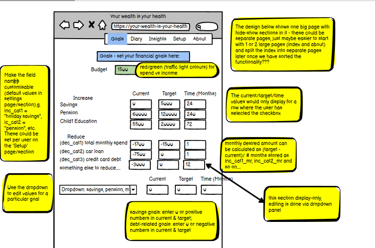

 

</h1>

# SUBMISSION
## 🚀 Deployment
#### 
The project is deployed and can be accessed at [here](https://kaylaesmith1.github.io/budget_busters/).

## ✔️ Criteria
In this section, we will briefly discuss how our team addressed the applicable criteria:

💡 The design provides the user with an easy to capture and track financial information. 

💡 Users can monitor and gain insights on how to reach their financial goals. 

💡 The project is responsive to mobile, tablet, laptop, and desktop screensizes.  

💡 The project is well-planned using GitHub Projects.

💡 The project has a well documented README based on the provided template.

# 📮 ABOUT SUBMISSION
## Intro
Budget Wise provides a low-cost, responsive, fully-accessible financial tracker and planner, and to help users achieve their financial goals.

It is aimed towards users who have access to a smartphone or larger-screen device, who have an income (we are currently thinking in terms of monthly income) which is their spending budget, and who are wish to track their spending data, in order to get insights on spending patterns and track progress towards their financial goals.

## 🎯Project Goals
The overall objective is to provide a low-cost, fully accessible financial tracker and planner that helps users achieve their financial goals.

➡️ Problem Statement - As a user I want to be able to easily track my expenditure so that I can achieve my financial goals.

➡️ Objective(s) - The main objective is to provide a low-cost, responsive, fully-accessible financial tracker and planner.

➡️ Target Audience - The target audience are all users who want to track their progress toward their financial goals with smartphones, tablets, laptops, and desktops.

➡️ Benefits - Insights can be gained on spending habits and patterns. Monitoring progress toward reaching your financial goals is easy and accessible. 

While creating this project we were mindful to future-proof for scalibility.  Google sheets with Flast/Jinga data transfers between HTML & python was initially trialled as a backend - this was chosen as it was felt that this app should really have a way of saving data so that a returning user can enter spending data, in particular, over a period of time.   However, while this worked successfully in a development environment, deployment presented time-consuming challenges!  A workaround was taken for BudgetWise version 1.  With this workaround, user data is preserved per device, therefore a mobile phone user can see insights on spedning patterns recorded on their device, over a period of time. 

A future version of BudgetWise could use Django frameworks which support full database and authentication functionality. 

## Design
### Color Scheme

### Typography

## UX Design
------------

### UX Design - Strategy
------------------------
Mobile-first development.

### UX Design Strategy - Target audience
* The target audience includes users who have access to a smartphone or larger-screen device, who have an income (we are currently thinking in terms of monthly income) which is their spending budget, and who are wish to track their spending data, in order to get insights on spending patterns and track progress towards their financial goals.

## UX Design Scope
----------------

### UX Design Scope - Data
The data being captured and displayed relates to a user's personal financial circumstances.
It allows the user to enter their budget, and to track their spending against their budget.
Based on the entered information, the app will give a detailed analysis of the users spending patterns and highlights 
Version 2 implementation will store the users financial data in a Google Sheets database.

### UX Design Scope Viewing Device 
* NB  The target audience are likely to commence using the site on desktop, and then to progress to small-screen use.
 
A 'mobile' first approach has been taken to development, with responsive screens, and with minimal keyboard data entry.
This makes the app particularly suitable for entry on small-screen/ mobile devices and is part of the USP for this app.

## User Goals/ User Stories
----------------

### First-time User Goals
* FTU_01  As a **first-time user** I want to **quickly understand the site purpose** so I **can decide whether to spend time exploring and discovering the site**

* FTU_02  As a **first-time user** I want to **easily navigate the site** so I **don't become frustrated and leave**

* FTU_03 As a **first-time user** I want to **be able to navigate the site without mandatory login** so **I can discover site features before deciding whether to commit to using site**

* FTU_04 As a **first-time user** I want to **increase my financial awareness** to **improve my personal financial circumstances**

* FTU_05 As a **first-time user** I want to **access this site on a device of my choosing (mobile, tablet, laptop, desktop)** so that I can **access by a method and at a time that is convenient and accessible to me**

### Returning User Goals
* RU_01 As  a **returning user** I want to **enter my financial goals** so I can **target what's important to me personally**

* RU_02 As a  **returning user** I want to **create a spending diary** so I can **track my spending over time**

* RU_03 As a **returning user** I want to **save data under my username** so I can **access my saved goals and spending history on subsequent site visits**

* RU_04 As a **returning user** I want to **set a monthly spending budget** so I **know what amount is available to me**

* RU_05 As a **returning user** I want to **see a breakdown of my spending by category** so I can **gain insights into my spending**

* RU_06 As a **returning user** I want to **see insights and trends of my spending** so I can **adjust my spending behaviour**

* RU_07 As a **returning user** I want to **track my progress against financial goals** so I can **adjust my spending behaviour if not meeting my goals**

### Site owner Goals
* SO_01 As **System Owner** I **want to provide a system that is easy to use** to **encourage users to visit and return to the site**

* SO_02 As **System Owner** I **want to provide responsive web pages** to **encourage users to use the site across multiple devices**

* SO_03 As **System Owner** I **want to provide interesting analysis and insights** to **increase user engagement with site**

* SO_04 As **System Owner** I want to **provide a low-cost website that can be implemented quickly** to **deliver this project**

* SO_05 As **System Owner** I want to **provide informative content** to **increase user's financial literacy and awareness**
   
## UX Design Decisions
----------------

### Wireframes

#### Financial Goals Page

#### Spending Diary Page

#### Insights Page

#### About Page

#### Settings Page 

### Typography

### Color Scheme

### Design Images

## Site Features
---------------

**F01 Site purpose is clearly identified and apparent a user who reaches the site**
(Future.  as in the very near future before we submit)
Information is organised logically, with goal-setting, spend tracking, budget monitoring and insight analysis.
There is an infomative 'About' page and an opportunity for the user to provide feedback, suggestions for future development, or issues withthe site. 

This satisfies user required FTU01 - clear site purpose in order to decide to proceed.

**F02 Ease of navigation**
The overall site layout follows a show-hide system, so relevant sections of the site are visible to the user.
A navgation bar gives ease of movement between the various site functions.  

At the bottom of each section there is a 'minimise' arrow to hide the relevant section and return to the navbar options.
This satisfies user requirements FTU02, FTU03, allowing the user, whether first-time or returning user to navigate smoothly within the site. 

**F03 Responsivess**
The site was constructed on a mobile-first principle.   Each section has been constructed to be responsive to the screen size of the device it is run on.   

Responsive design principles such as using on-sceen buttons, pre-filled prompts and pop-ups rather than text-based entry,  make the site good for small-screen usage.

This satisfies first-time user requirements FTU05

**F04 Accessibility and Performance**
The site performs well and satisfies accessibility guidenlines
<screenprint of lighthouse performance>
<screenprint of W3C accessibility checker>

**F05 Comprehsnsive site pages**
There are 5 areas of functionality available to the user:
* Spending diary and budget setting
* Insights to spending patterns
* Financial Goal setting
* Feedback Form
* About Us
    
**F06 Spending Diary**

This page allow the user to set a working budget:

and then to record spending against it

**F07 Insights**
This screen is very powerful and will definitely be an area for future development.  For now, a good 'engine' has been developed, and in future versions, the graphical feedback to the user could be enhanced

Choose a type of analysis:

And see a detailed breakdown of spending:

**F08 Goal Setting**
A goal setting screen is provided where the user can add customised financial goals.

**F09 Contact Us Page**

**F10 About Us**

### Features in Scope - features vs user stories (requirements) 
This website includes 6 functional screens and XX features 
Features are as listed in previous section.
The pages - which effectively bring these features together - are:
* Landing page (image link)
* Goals/settings screen (image link)
* Spending Diary screen (image link)
* Insights (image link)
* Contact/Feedback page (image link)
* About-Us page (image link)

- __Landing Page__
This page welcomes the user to the site and....

- __Goals/settings screen__
(This page shows details.... may remove this section as goals can become Version2 of this app) 

- __Spending Diary__
This screen allows the user to record and track their spending against a budget.
This screen is designed to minimise keying and is a really strong feature of the app.

- __Insights screen__
This is a really powerful feature of the app.  

- __Contact/feedback screen__
This screen encourages users to interact with the applciation by entering feedback, useful comments, and participating in the development roadmap for this app. The ability to send a contact form will enable the user to comment on existing site features, bugs they find (hopefully none!) and/or additional features they would like included in future versions of the app.

    The contact email is fully functional, though we ran into some issues with the attachement option. As of now, the user can attach a document but it is not delivered in the email to Budget Wise. In a future version, we would hope to rectify this and implement a pop up telling the user their email was sent successfully and clear the input fields after they submit their form.

- __About__
This page gives some background to the app, the development team, with profile photos and contact details.

### Features Left to Implement
Some of the user stories could be addressed more directly in the future:
* Deploy connected front- and back-end
Considerable development work was done for the app version 1 to create a Google Sheets backend.  This has been tested and updates data successfully in the development environment, with working CRUD functionality.  Flask/ Jinga have been tested and proven to successfully exchange data between the html frontend and the python backend.  However, deployment proved overly difficult and hence scope of Version was reduced to focus on direct user functionality.

## 💻 Tech Stack
- HTML
- CSS
- JavaScript
- Python
- Flask
- Google Sheets

## 💻 Python libraries
- os
- colorama
- gspread - used to reading and updating information to Google Sheets
- tabulate

## Validation

## 🙌 Credits
The team consisted of: Kayla Smith (scrum master), Nikola Simic, Caylin Dewey, and Deirdre McCarthy.

## 🌐 Media, Frameworks, Libraries & Programs Used

- [Git](https://git-scm.com/) - For version control.

- [GitHub](https://github.com/) - To save, store, and deploy files.  GitHub projects was used on a Kanban board to track tickets.

- [Google Cloud Console](https://console.cloud.google.com/) - An API was used to provide a database for this project.

- [Bootstrap](https://getbootstrap.com/) - For a CSS framework enabling responsive and mobile first websites.

- [Logo](http://brandcrowd.com/) - For the logo.

- [Coolers](http://coolers.com/) - The JanHack Color Scheme was used. 

- [Font](https://fontawesome.com/) - Was used to source the favicon.

- [Google Fonts](https://fonts.google.com/) - To import the fonts used on the website.

- [Balsamic](https://balsamiq.com/) - To create wireframes.

- [Google Dev Tools](https://developer.chrome.com/docs/devtools/) - To ensure responsiveness and styling.

- [Am I Responsive?](http://ami.responsivedesign.is/) - To display image on range of devices.

- [Shields.io](https://shields.io/) - To use badges for the README file

- [ChatGPT](https://chat.openai.com/) - To format and check code, spelling and grammar.

- [Emojipedia](https://emojipedia.org/) - To source emojis

